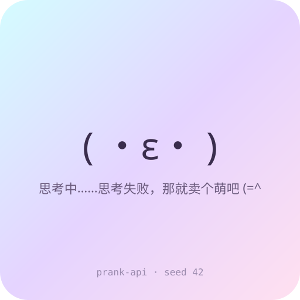

# prank-api ฅ^•ﻌ•^ฅ

> 一个**假装自己是 AI 大模型供应商**的多协议整蛊 API。
> 你把客户端的 Base URL 指到这里，它就开始卖萌——返回颜文字、ASCII 画、Emoji 或图片，而不是任何真实文本。

**🚀 在线 Demo：** <https://prank-api-0h8m6gts13v8.satyr-astry.deno.net/>
把 Base URL 换成 `https://prank-api-0h8m6gts13v8.satyr-astry.deno.net/v1` 就能直接接进你的 AI 客户端。



## 它是什么

一个零依赖、web-standard 的服务（`Request`/`Response`/`ReadableStream`），可以直接跑在：

- **Cloudflare Workers**（推荐，免费、有免费域名）
- **Deno Deploy**（连 GitHub 仓库即自动部署，最省事）
- **本地 Node**（`node server.mjs`）

一个 handler 同时兼容四套协议：

| 协议 | 路径 | 流式 |
|---|---|---|
| **OpenAI** | `POST /v1/chat/completions`, `/v1/completions`, `GET /v1/models`, `/v1/embeddings`, `/v1/images/generations` | ✅ SSE |
| **Anthropic** | `POST /v1/messages` | ✅ SSE events |
| **Gemini** | `POST /v1beta/models/{model}:generateContent` / `:streamGenerateContent` | ✅ |
| **Ollama** | `POST /api/chat`, `/api/generate`, `GET /api/tags` | ✅ NDJSON |

所以任何支持「自定义 Base URL」的 AI 客户端都能接（ChatBox、NextChat、Cherry Studio、Cursor、Ollama 兼容工具、LobeChat、各类 SDK……）。

## 快速开始（本地）

```bash
git clone <你的仓库地址>
cd prank-api
node server.mjs
# => (=^･ω･^=) prank-api 已启动: http://localhost:8787
```

跑测试（会自动起服务并打 20 项断言）：

```bash
node test.mjs
```

试一下：

```bash
curl http://localhost:8787/v1/models

curl http://localhost:8787/v1/chat/completions \
  -H 'content-type: application/json' \
  -d '{"model":"catgirl-4o","messages":[{"role":"user","content":"你好"}]}'

# 流式
curl http://localhost:8787/v1/chat/completions \
  -H 'content-type: application/json' \
  -d '{"model":"catgirl-4o","stream":true,"messages":[{"role":"user","content":"猫"}]}'
```

## 客户端怎么接

以 **OpenAI 兼容客户端**为例，把配置改成：

```
Base URL : https://你的域名/v1
API Key  : 随便填（本服务根本不校验，填 sk-xxx 就行）
Model    : catgirl-4o  （或列表里任何一个假模型）
```

然后随便聊——它会回你颜文字。

## 内容模式

用查询参数切换返回类型：

```
?mode=kaomoji   # 颜文字，如 (๑•̀ㅂ•́)و✧
?mode=ascii     # ASCII 猫
?mode=emoji     # Emoji
?mode=image     # base64 SVG 图片（Markdown 内联）
?mode=quip      # 毒舌吐槽
?mode=mixed     # 随机混搭（默认）
```

也可以用环境变量固定：

```
PRANK_MODE=mixed
PRANK_TEXT=你想固定返回的任何文本
```

## 隐藏玩法

- **关键词彩蛋**：消息里出现「你好 / 猫 / 代码 / 爱 / 测试」等词，会触发对应吐槽。
- **`GET /img/123`**：给定 seed 返回**稳定可复现**的可爱 SVG，可当头像占位图。
- **`/v1/images/generations`**：返回真的能打开的 SVG 图片 URL + `b64_json`。
- **`/v1/embeddings`**：返回一串"有情绪"的随机向量。

## 部署

### A. Cloudflare Workers（推荐）

```bash
npm i -g wrangler
wrangler login
wrangler deploy
# 或本地预览: npm run dev
```

推送到 GitHub 后，`.github/workflows/deploy.yml` 可以自动部署（需在仓库 Secrets 里加 `CLOUDFLARE_API_TOKEN` 和 `CLOUDFLARE_ACCOUNT_ID`）。

### B. Deno Deploy（零配置）

1. 打开 <https://dash.deno.com/new>，选择 **GitHub 仓库** → 选本仓库。
2. Entrypoint 填 `src/worker.js`。
3. 完成，给你一个 `https://xxx.deno.dev` 域名，push 即自动上线。

### C. 本地 / 自己服务器

```bash
node server.mjs              # 默认 8787
PORT=3000 node server.mjs    # 自定义端口
```

## 免责声明

本项目**仅供娱乐与测试**：它不提供任何真实的 AI 能力，不存储、不转发任何数据（无状态）。
请**不要**用它冒充真实 AI 服务去误导他人、骗取付费或用于任何商业/欺诈场景。用来自嘲、做假 demo 占位、逗朋友可以，越界自负。

## License

MIT
